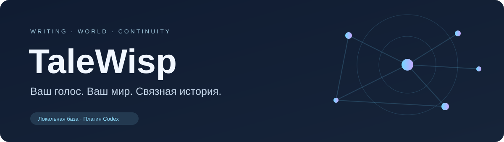
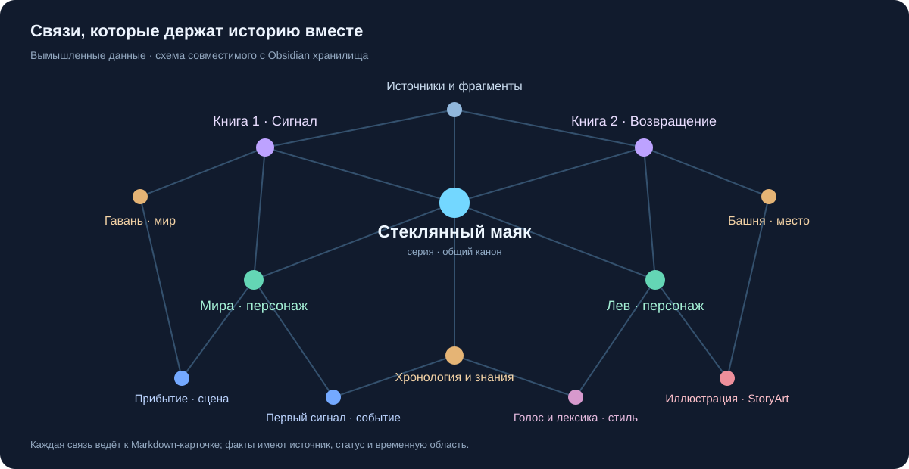

<p align="center">
  
</p>

<p align="center">
  <strong>Писательский помощник, который работает с вашим текстом, голосом и каноном.</strong><br>
  Codex · Google Docs · Obsidian · StoryArt
</p>

<p align="center">
  <a href="https://github.com/Underslumber/TaleWisp/releases/latest">Скачать плагин</a> ·
  <a href="docs/INSTALL.md">Установка</a> ·
  <a href="docs/AI-INSTALL.md">Поручить установку ИИ</a> ·
  <a href="https://github.com/Underslumber/StoryArt">StoryArt</a>
</p>

TaleWisp помогает писать и редактировать художественные тексты, собирать базу
произведения из разных источников и держать рядом сюжет, персонажей, знания героев и авторский стиль.
Вы задаёте замысел и принимаете изменения; плагин собирает нужный контекст
и выполняет рабочий процесс в Codex.

**Разработка — в GitHub. Авторская работа — через плагин.**
Рукописи, базы произведений и личные профили стиля хранятся отдельно у автора.
Репозиторий и релиз содержат код, общие инструкции и пустые шаблоны.

## От книги к связанному миру

Приложите книги, документы, заметки или укажите доступные ссылки и напишите:

> Создай базу по этим источникам.

TaleWisp спросит псевдоним, прочитает источники и развернёт базу по заложенному
механизму. Значимые записи получают источник, статус и границы действия
во времени. Общее хранилище серии сохраняет различия между книгами.

Файлы FB2, TXT, Markdown, HTML, DOCX и EPUB читаются напрямую. PDF,
облачные документы, веб-страницы, сканы, аудио и видео проходят через доступный
инструмент чтения, OCR или транскрипции. Плагин сохраняет локальный снимок
с происхождением и проверкой полноты. Для недоступного источника он сообщает,
чего не хватает. [Форматы и механизм извлечения](plugin/skills/build-series-base/references/source-inputs.md).
Заметки и справочные статьи остаются источниками фактов; вымышленные события
для них не создаются.

<p align="center">
  
  <br><sub>Демонстрационная схема на вымышленных данных. Это не скрин приватной базы и не результат импорта пользовательских книг.</sub>
</p>

| Возможность | Что получает автор |
|---|---|
| База из разных источников | Автор → серия → книги; девять слоёв анализа, проверка покрытия и независимое ревью |
| Связи Obsidian | Markdown-карточки и `[[ссылки]]` между героями, сценами, миром и событиями |
| Размеченный канон | Проверки участия после смерти, завязок и развязок, использования знаний по явному контракту с источниками |
| Подготовка разметки | Предложения из прочитанных источников с точными цитатами и отдельной проверкой смысла; применение после одобрения автора |
| Знания на начало сцены | Раздельные знания героя и доступ читателя; явные пропуски при недостатке данных |
| Влияние правок | Изменённые источники, связанные записи и зависимые утверждения в выбранных контрактах |
| Очередь пробелов | Приоритетные задачи с указанием недостающих доказательств и ограничений покрытия |
| Письмо и продолжение | Готовая проза с учётом выбранного голоса, замысла сцены и знаний героя |
| Редактура | Предложение изменений; проверка исходника и резервная копия перед подтверждённым применением |
| Google Docs | Чтение текста и комментариев; при редактуре требуются нативные предложения и привязанные комментарии |
| Авторский стиль | Раздельные локальные профили; обучение и калибровка только по запросу |
| StoryArt | Задание на иллюстрацию и связи утверждённого арта со сценой и персонажем |

В обычном письме одно точное задание приводит к готовому тексту. Дополнительное
ревью подключается по просьбе автора или конкретному риску. Тренировочные
соревнования не запускаются автоматически.

Проверки размеченного канона работают по явно подготовленному JSON-контракту
с путями, SHA256 и цитатами источников. Они проверяют перечисленные записи;
полнота свободной прозы и всей базы этим не подтверждается. Сюжетное время
и порядок раскрытия читателю задаются отдельно. [Формат контракта](plugin/skills/write-fiction/references/continuity-contract.md)
и [исследование практик Story Skills](docs/STORY_SKILLS_ADOPTION.md).

Для подготовки такого контракта предусмотрен [режим извлечения](plugin/skills/write-fiction/references/continuity-extraction.md):
агент читает полный ограниченный пакет источников, извлекает предложения,
а независимый рецензент проверяет, подтверждают ли цитаты каждое утверждение.
Совпадение цитаты с текстом проверяется отдельно от её смысла. Результат
сохраняется как ожидающее одобрения предложение; источники повторно сверяются
при применении. Неизвестные координаты и неподтверждённые выводы не становятся каноном.

## Писать естественно

> Продолжи сцену в моём стиле. Сохрани события, мотивацию и знания героя.
> Сначала покажи текст, ничего не применяй.

> Проверь главу на противоречия с каноном. Укажи источники и предложи
> минимальные исправления.

> Прочитай сцену в Google Doc и все комментарии с ответами. Подготовь
> точечную редакцию; документ пока не меняй.

Google Drive подключается отдельно. Если connector не поддерживает нужную
нативную операцию, TaleWisp сохраняет подготовленное предложение и сообщает,
что запись не выполнена. Прямое изменение рукописи требует явного запроса автора.

## TaleWisp + StoryArt

[StoryArt](https://github.com/Underslumber/StoryArt) отвечает за визуальное
производство; TaleWisp — за канон и смысл сцены. Персонаж связывается с постоянной
визуальной идентичностью StoryArt, а новая иллюстрация получает отдельный
чат с кратким заданием и источниками.

```text
Локальная база автора
        │ канон, персонаж, сцена, замысел
        ▼
     TaleWisp ── задание ──► StoryArt
        ▲                     │
        │ проверка канона     │ визуальная проверка
        └────── кандидат ◄────┘
                  │
          одобрение автора
                  ▼
     карточка иллюстрации + связи в базе
```

Обе проверки и явное одобрение автора нужны до закрепления иллюстрации в базе.
Кандидат хранится отдельно от подтверждённого арта. TaleWisp не выбирает
внутренние референсы StoryArt и не генерирует изображение вместо него.

В StoryArt TaleWisp можно предложить как дополнительный плагин для работы
с книгой и каноном. Установка выполняется после согласия пользователя,
без передачи его базы в репозиторий. [Протокол связей](plugin/skills/coordinate-talewisp-storyart/references/persistent-links.md).

## Начать работу

Основной путь — подключить GitHub marketplace и установить плагин.
Для передачи фиксированной версии без Git есть ZIP в Releases с SHA-256
и файловым manifest. Скачивание всего проекта нужно разработчику.

```powershell
codex plugin marketplace add Underslumber/TaleWisp --ref v0.6.2 --json
```

```powershell
codex plugin add talewisp@underslumber-talewisp --json
```

Откройте новую задачу в своей локальной папке. Для начала можно написать:

> Используй TaleWisp. Познакомься со мной как с автором и помоги выбрать:
> конкретная сцена, база серии или анализ моего стиля.

**[Короткая инструкция для ИИ](docs/AI-INSTALL.md)** позволяет поручить установку
агенту, включая проверку пакета и создание собственной базы из ваших источников.

Текущий локальный MCP рассчитан на **Windows + Python 3.10+**.
Obsidian нужен при желании работать с графом и Markdown вручную.
Google Drive connector нужен для Google Docs/Sheets.

## Для разработчиков

| Путь | Назначение |
|---|---|
| `plugin/` | Исходники плагина, навыки, локальный MCP и общие шаблоны |
| `.agents/plugins/marketplace.json` | Каталог для штатной установки Codex |
| `scripts/build_release.py` | Сборка проверяемого ZIP без авторских данных |
| `tests/publication/` | Проверки границ публичного пакета |
| `docs/` | Установка, инструкция для ИИ и демонстрационные схемы |

Рабочие базы и приватные данные исключены из Git списком разрешённых путей.
ZIP собирается из разрешённых компонентов. Шаблоны не являются готовой базой:
импорт заканчивается только после чтения, проверки и ревью.

[Подробная установка](docs/INSTALL.md) ·
[Механизм базы серии](plugin/skills/build-series-base/SKILL.md) ·
[Производственный маршрут](plugin/skills/write-fiction/references/production-input.md)
